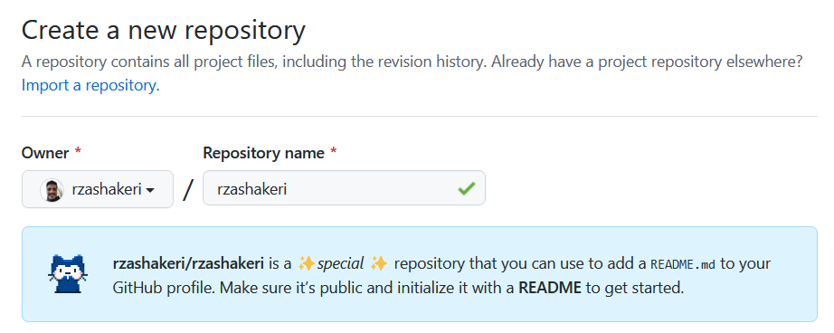
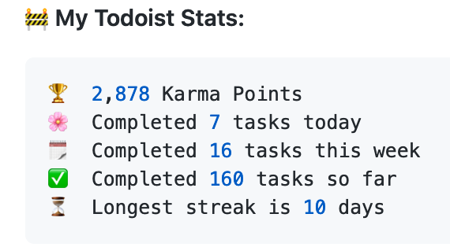
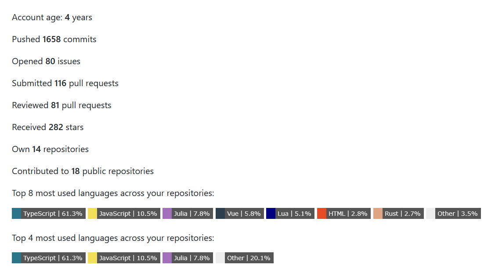

# Hello friends 🖐️

how are you If you want to make the look of your github profile more beautiful, you have come to the right place

# 📌 The first step : Set up the GitHub Repository

Create a repository with your GitHub username 👇

 

 

Template : 👇

    https://github.com/username/username

Example : 👇

    https://github.com/rzashakeri/rzashakeri

### **Create a README.md** and Done ✅

Now that we have built the repository, we come to the interesting part: **designing our README.md.**

# 💡 Where do we get ideas ?

You must have been asked which profiles to get ideas from? You can see the profile of different people through the site below the gateway profile and get ideas from them 👇

## [🔗 Awesome Github Profile ](https://zzetao.github.io/awesome-github-profile/)

# 🚩 What do we do after seeing these profiles ?

Well, so far you have been able to find cool ideas from the profiles of different people. Now it's time to use different tools to beautify your gate hub profile, which you can access from the list below.

## 🧩 Badges 👇

#### 1 . [List of Badges, in Markdown](https://github.com/Naereen/badges)

A list of badges and cards, with their Markdown code, that can be included in a README.md file for a GitHub

📍 For example : &nbsp;  &nbsp;  &nbsp;  &nbsp; 

#### 2 . [Markdown badges in many different categories ](https://github.com/Ileriayo/markdown-badges)

Badges for your personal developer branding, profile, and projects.
 
 

📍 For example : &nbsp;  &nbsp;  &nbsp;  &nbsp; 
 
 

#### 3 . [Count Visitors Badges](https://github.com/jwenjian/visitor-badge)

A badge generator service to count visitors of your markdown file.

📍 For example : &nbsp;  &nbsp; 
 
 

#### 4 . [shields](https://shields.io/)

Concise, consistent, and legible badges in SVG and raster format and Make tokens with custom values

📍 For example : &nbsp;  &nbsp;  &nbsp; 
 

#### 5 . [laravel github profile view counter](https://github.com/caneco/laravel-github-profile-view-counter)

This package will allows you to track Github profile views and display them in your profile readme, for free.

#### 6 . [Stackoverflow Badge](https://github.com/claytonjhamilton/stackoverflow-badge)

Display your stats with this unique StackOverflow Badge

📍 For example : &nbsp; 
 
 

#### 7 . [Github README YouTube Stats](https://github.com/DenverCoder1/github-readme-youtube-stats)

Youtube stats badges for your Github profile README. Displays the total number of subscribers or the view count for your channel.

📍 For example : &nbsp;  &nbsp; 
 
 

#### 8 . [ Badges for GitHub](https://github.com/Envoy-VC/Badges-for-GitHub)

A Curated list of Badges used in GitHub
 
 
📍 For example : &nbsp;  &nbsp;  &nbsp; 
 
 

#### 9 . [Badges 4 README.md Profile](https://github.com/alexandresanlim/Badges4-README.md-Profile)

Improve your README.md profile with these amazing badges.

 
📍 For example :
 
 
   
 
 

#### 10 . [Gitwar](https://github.com/iampavangandhi/Gitwar)

Gitwar - Compete with Github Check your Github Score. Based on -
Your Public Repos , Stars on Public Repos , Forks on Public Repos , Github Followers ,Joined Github Organisations ...

 
📍 For example :
 
 

 
 
 

#### 11 . [Github Profile Views Counter](https://github.com/antonkomarev/github-profile-views-counter)

It counts how many times your GitHub profile has been viewed. Free cloud micro-service.

 
📍 For example : 
 
 
 &nbsp; 
 
 

#### 12 . [Github Profile Views Counter](https://github.com/arturssmirnovs/github-profile-views-counter)

Github new features README profile views counter made with Yii2 framework.

 
📍 For example : 
 
 

 
 

---

## 🛠️ Widgets 👇

#### 1 . [Todoist Readme](https://github.com/abhisheknaiidu/todoist-readme)

Updates README with Todoist Stats of a user
 

📍 For example : &nbsp;
 

 
 

#### 2 . [github readme stats](https://github.com/anuraghazra/github-readme-statss)

Dynamically generated stats for your github readmes
 

📍 For example : &nbsp;
 

 
 

 
 

#### 3 . [GitHub Readme Streak Stats](https://github-readme-streak-stats.herokuapp.com/demo/)

Stay motivated and show off your contribution streak! 🌟 Display your total contributions, current streak, and longest streak on your GitHub profile README
 

📍 For example : &nbsp;
 

 
 

#### 4 . [waka readme](https://github.com/athul/waka-readme)

Wakatime Weekly Metrics on your Profile Readme.
 

📍 For example : &nbsp;
 

 
 

#### 5 . [Profile Activity Generator](https://github.com/omidnikrah/profile-activity-generator)

Generate custom profile activity for your profile README  
 

📍 For example : &nbsp;
 

 
 

#### 6 . [Github Activity Readme](https://github.com/jamesgeorge007/github-activity-readme)

Updates README with the recent GitHub activity of a user
 

📍 For example : &nbsp;
 

 
 

#### 7 . [Github Profile Readme Generator](https://rahuldkjain.github.io/gh-profile-readme-generator)

Generate GitHub profile README easily with the latest add-ons like visitors count, GitHub stats, etc using minimal UI.
 

📍 For example : &nbsp;
 

 
 

#### 8 . [Github Action Dynamic Profile Page](https://github.com/umutphp/github-action-dynamic-profile-page/)

GitHub Action to push updates to your special profile repository.
 

📍 For example : &nbsp;
 

 
 

#### 9 . [waka readme stats](https://github.com/anmol098/waka-readme-stats)

This GitHub action helps to add cool dev metrics to your github profile Readme
 

📍 For example : &nbsp;
 

 
 

#### 10 . [Profile Readme](https://github.com/actions-js/profile-readme)

Display profile activity and other cool widgets in your profile README.md
 

📍 For example : &nbsp;
 

💪 Opened PR #43 in webview/webview_deno 
❗️ Closed issue #32 in denosaurs/denon 
🗣 Commented on #6 in nestdotland/hatcher 
❗️ Closed issue #22 in nestdotland/eggs 
🗣 Commented on #15 in nestdotland/eggs 
 
 

#### 11 . [Spotify Github Profile](https://github.com/kittinan/spotify-github-profile)

Show your Spotify playing on your Github profile
 

📍 For example : &nbsp;

 

 

 
 

#### 12 . [Blog Post Workflow](https://github.com/kittinan/spotify-github-profile)

Show your latest blog posts from any sources or StackOverflow activity or Youtube Videos on your GitHub profile/project readme automatically using the RSS feed
 

📍 For example : &nbsp;

 

 
 

#### 13 . [Github Readme Medium](https://github.com/omidnikrah/github-readme-medium)

Dynamically generated your latest Medium article on your GitHub readmes!
 

📍 For example : &nbsp;

 

 

#### 14 . [Github Readme Stackoverflow](https://github.com/omidnikrah/github-readme-stackoverflow)

Dynamically generated your StackOverflow status on your GitHub READMEs!
 

📍 For example : &nbsp;

 
  

 
 

#### 15 . [Github Profile Readme Generator](https://arturssmirnovs.github.io/github-profile-readme-generator/)

GitHub profile readme generator allows you to create nice and simple GitHub profile readme files that will be included in your profile previews.
 

📍 For example : &nbsp;

 

#### 16 . [Profile Readme Stats](https://github.com/teoxoy/profile-readme-stats)

Showcase your github stats on your profile README.md
 

📍 For example : &nbsp;

 

 
 

#### 17 . [Readme Jokes](https://github.com/ABSphreak/readme-jokes)

😄 Jokes for your GitHub READMEs
 

📍 For example : &nbsp;

 

 
 
 
 
 
 
 

#### 18 . [Github Profile Trophy](https://github.com/ryo-ma/github-profile-trophy)

Add dynamically generated GitHub Stat Trophies on your readme
 

📍 For example : &nbsp;

 
 

#### 19 . [Github Readme Twitter](https://github.com/ryo-ma/github-profile-trophy)

Add Twitter to your github readme
 

📍 For example : &nbsp;

 
 

#### 20 . [Random Memer](https://github.com/ryo-ma/github-profile-trophy)

Returns random meme images scraped from Memedroid
 
 

#### 21 . [Github Profilinator](https://github.com/ryo-ma/github-profile-trophy)

This tool contains mini GUI components that you can hook together to automatically generate markdown code for a perfect readme.
 

📍 For example : &nbsp;

 
 

#### 22 . [Readme Pagespeed Insights](https://github.com/ankurparihar/readme-pagespeed-insights)

Google lighthouse stats of your website that you can put in readme
 
 

📍 For example : &nbsp;

 

 
 

#### 23 . [REHeader](https://reheader.glitch.me/)

Generate beautiful header images for your GitHub profile READMEs.
 
 

📍 For example : &nbsp;

 

 
 

#### 24 . [Goodreads Readme](https://github.com/theFr1nge/goodreads-readme)

This project provides a badge for sharing your current book in your github profile.
 
 

📍 For example : &nbsp;

 

 
 

#### 25 . [Readme Typing svg](https://github.com/DenverCoder1/readme-typing-svg)

Dynamically generated, customizable SVG that gives the appearance of typing and deleting text. Typing SVGs can be used as a bio on your Github profile readme or repository.
 
 

📍 For example : &nbsp;

 

 

#### 26 . [Awesome Github Profile Readme Templates](https://github.com/durgeshsamariya/awesome-github-profile-readme-templates)

This repository contains best profile readme's for your reference.  
 

#### 27 . [Profile Summary For Github](https://github.com/tipsy/profile-summary-for-github)

Tool for visualizing GitHub profiles  
 
📍 For example : &nbsp;

 

 
 

#### 28 . [Github Profile Summary Cards](https://github.com/vn7n24fzkq/github-profile-summary-cards)

A tool to generate your github summary card for profile README
 

📍 For example : &nbsp;

 

 
 

#### 29 . [Generate Snake Game From Github Contribution Grid](https://github.com/marketplace/actions/generate-snake-game-from-github-contribution-grid)

Generates a snake game from a github user contributions graph
 
📍 For example : &nbsp;

 

 
 

#### 30 . [githubProfileReadmeGenerator](https://github.com/rahulbanerjee26/githubProfileReadmeGenerator)

Generate a cool README/About me page for your Github Profile

 
📍 For example : &nbsp;

 

 
 

#### 31 . [Github Stats Transparent](https://github.com/rahul-jha98/github-stats-transparent)

Automatically generate summary GitHub statistics images for your profile using Actions, no server required

 
📍 For example : &nbsp;

 

 
 

#### 32 . [Github Profile Name Writer](https://github.com/ironmaniiith/Github-profile-name-writer)

Write your name using the github commits and make your profile awesome

 
📍 For example : &nbsp;

 

 
 

#### 33 . [Github Profile Languages](https://github.com/IonicaBizau/github-profile-languages)

Create a nice pie chart with the user's programming languages from their GitHub profile.

 
📍 For example : &nbsp;

 

 
 

#### 34 . [Github Profile Readme Maker](https://github.com/VishwaGauravIn/github-profile-readme-maker)

Best Profile Generator, Create your perfect GitHub Profile ReadMe in the best possible way. Lots of features and tools included, all for free !

 
📍 For example : &nbsp;

 

 
 

#### 35 . [Github Profile 3d Contrib](https://github.com/yoshi389111/github-profile-3d-contrib)

This GitHub Action creates a GitHub contribution calendar on a 3D profile image.

 
📍 For example : &nbsp;

 

 
 

#### 36 . [Github Profile Header Generator](https://github.com/leviarista/github-profile-header-generator)

 A header image generator for your Github profile Readme 

 
📍 For example : &nbsp;

 

 
 

#### 37 . [metrics](https://github.com/lowlighter/metrics)

An infographics generator with 30+ plugins and 200+ options to display stats about your GitHub account and render them as SVG, Markdown, PDF or JSON! 

 
📍 For example : &nbsp;

 

<table>
  <tbody><tr>
    <th align="center">For user accounts</th>
    <th align="center">For organization accounts</th>
  </tr>
  <tr>
    <td align="center">

</td>
<td align="center">

</td>
  </tr>
  <tr>
    <th colspan="2" align="center">
      <h3 dir="auto"><a id="user-content--customizable-with-40-plugins-and-258-options" class="anchor" aria-hidden="true" href="#-customizable-with-40-plugins-and-258-options"><svg class="octicon octicon-link" viewBox="0 0 16 16" version="1.1" width="16" height="16" aria-hidden="true"><path fill-rule="evenodd" d="M7.775 3.275a.75.75 0 001.06 1.06l1.25-1.25a2 2 0 112.83 2.83l-2.5 2.5a2 2 0 01-2.83 0 .75.75 0 00-1.06 1.06 3.5 3.5 0 004.95 0l2.5-2.5a3.5 3.5 0 00-4.95-4.95l-1.25 1.25zm-4.69 9.64a2 2 0 010-2.83l2.5-2.5a2 2 0 012.83 0 .75.75 0 001.06-1.06 3.5 3.5 0 00-4.95 0l-2.5 2.5a3.5 3.5 0 004.95 4.95l1.25-1.25a.75.75 0 00-1.06-1.06l-1.25 1.25a2 2 0 01-2.83 0z"></path></svg></a><a href="/lowlighter/metrics/blob/master/README.md#-plugins"><g-emoji class="g-emoji" alias="jigsaw" fallback-src="https://github.githubassets.com/images/icons/emoji/unicode/1f9e9.png">🧩</g-emoji> Customizable with 40 plugins and 258 options!</a></h3>
    </th>
  </tr>
  <tr>
    <th><a href="/lowlighter/metrics/blob/master/source/plugins/isocalendar/README.md"><g-emoji class="g-emoji" alias="date" fallback-src="https://github.githubassets.com/images/icons/emoji/unicode/1f4c5.png">📅</g-emoji> Isometric commit calendar</a></th>
    <th><a href="/lowlighter/metrics/blob/master/source/plugins/languages/README.md"><g-emoji class="g-emoji" alias="u6708" fallback-src="https://github.githubassets.com/images/icons/emoji/unicode/1f237.png">🈷️</g-emoji> Most used languages</a></th>
  </tr>
  <tr>
        <td align="center">
        

Full year calendar

        

Half year calendar

        
      </td>
        <td align="center">
        

Indepth analysis (clone and analyze repositories)

        

Recently used (analyze recent activity events)

        

Default algorithm

        

Default algorithm (with details)

        
      </td>
  </tr>
  <tr>
    <th><a href="/lowlighter/metrics/blob/master/source/plugins/topics/README.md"><g-emoji class="g-emoji" alias="pushpin" fallback-src="https://github.githubassets.com/images/icons/emoji/unicode/1f4cc.png">📌</g-emoji> Starred topics</a></th>
    <th><a href="/lowlighter/metrics/blob/master/source/plugins/stars/README.md"><g-emoji class="g-emoji" alias="star2" fallback-src="https://github.githubassets.com/images/icons/emoji/unicode/1f31f.png">🌟</g-emoji> Recently starred repositories</a></th>
  </tr>
  <tr>
        <td align="center">
        

With icons

        

With labels

        
      </td>
        <td align="center">
        
        
      </td>
  </tr>
  <tr>
    <th><a href="/lowlighter/metrics/blob/master/source/plugins/licenses/README.md"><g-emoji class="g-emoji" alias="scroll" fallback-src="https://github.githubassets.com/images/icons/emoji/unicode/1f4dc.png">📜</g-emoji> Repository licenses</a></th>
    <th><a href="/lowlighter/metrics/blob/master/source/plugins/habits/README.md"><g-emoji class="g-emoji" alias="bulb" fallback-src="https://github.githubassets.com/images/icons/emoji/unicode/1f4a1.png">💡</g-emoji> Coding habits</a></th>
  </tr>
  <tr>
        <td align="center">
        

Permissions, limitations and conditions

        

Licenses overview

        
      </td>
        <td align="center">
        

Recent activity charts

        

Midly interesting facts

        
      </td>
  </tr>
  <tr>
    <th><a href="/lowlighter/metrics/blob/master/source/plugins/contributors/README.md"><g-emoji class="g-emoji" alias="medal_sports" fallback-src="https://github.githubassets.com/images/icons/emoji/unicode/1f3c5.png">🏅</g-emoji> Repository contributors</a></th>
    <th><a href="/lowlighter/metrics/blob/master/source/plugins/followup/README.md"><g-emoji class="g-emoji" alias="tickets" fallback-src="https://github.githubassets.com/images/icons/emoji/unicode/1f39f.png">🎟️</g-emoji> Follow-up of issues and pull requests</a></th>
  </tr>
  <tr>
        <td align="center">
        

By contribution types

        

By number of contributions

        
      </td>
        <td align="center">
        

Indepth analysis

        

Created on a user's repositories

        

Created by a user

        
      </td>
  </tr>
  <tr>
    <th><a href="/lowlighter/metrics/blob/master/source/plugins/reactions/README.md"><g-emoji class="g-emoji" alias="performing_arts" fallback-src="https://github.githubassets.com/images/icons/emoji/unicode/1f3ad.png">🎭</g-emoji> Comment reactions</a></th>
    <th><a href="/lowlighter/metrics/blob/master/source/plugins/people/README.md"><g-emoji class="g-emoji" alias="people_holding_hands" fallback-src="https://github.githubassets.com/images/icons/emoji/unicode/1f9d1-1f91d-1f9d1.png">🧑‍🤝‍🧑</g-emoji> People plugin</a></th>
  </tr>
  <tr>
        <td align="center">
        
        
      </td>
        <td align="center">
        

Related to a user

        

Related to a repository

        
      </td>
  </tr>
  <tr>
    <th><a href="/lowlighter/metrics/blob/master/source/plugins/stargazers/README.md"><g-emoji class="g-emoji" alias="sparkles" fallback-src="https://github.githubassets.com/images/icons/emoji/unicode/2728.png">✨</g-emoji> Stargazers over last weeks</a></th>
    <th><a href="/lowlighter/metrics/blob/master/source/plugins/projects/README.md"><g-emoji class="g-emoji" alias="card_index_dividers" fallback-src="https://github.githubassets.com/images/icons/emoji/unicode/1f5c2.png">🗂️</g-emoji> Active projects</a></th>
  </tr>
  <tr>
        <td align="center">
        

Classic charts

        

Chartist charts

        
      </td>
        <td align="center">
        
        
      </td>
  </tr>
  <tr>
    <th><a href="/lowlighter/metrics/blob/master/source/plugins/code/README.md"><g-emoji class="g-emoji" alias="sagittarius" fallback-src="https://github.githubassets.com/images/icons/emoji/unicode/2650.png">♐</g-emoji> Code snippet of the day</a></th>
    <th><a href="/lowlighter/metrics/blob/master/source/plugins/activity/README.md"><g-emoji class="g-emoji" alias="newspaper" fallback-src="https://github.githubassets.com/images/icons/emoji/unicode/1f4f0.png">📰</g-emoji> Recent activity</a></th>
  </tr>
  <tr>
        <td align="center">
        
        
      </td>
        <td align="center">
        
        
      </td>
  </tr>
  <tr>
    <th><a href="/lowlighter/metrics/blob/master/source/plugins/achievements/README.md"><g-emoji class="g-emoji" alias="trophy" fallback-src="https://github.githubassets.com/images/icons/emoji/unicode/1f3c6.png">🏆</g-emoji> Achievements</a></th>
    <th><a href="/lowlighter/metrics/blob/master/source/plugins/notable/README.md"><g-emoji class="g-emoji" alias="tophat" fallback-src="https://github.githubassets.com/images/icons/emoji/unicode/1f3a9.png">🎩</g-emoji> Notable contributions</a></th>
  </tr>
  <tr>
        <td align="center">
        

Compact display

        

Detailed display

        
      </td>
        <td align="center">
        

Indepth analysis

        

Contributions in organizations only

        
      </td>
  </tr>
  <tr>
    <th><a href="/lowlighter/metrics/blob/master/source/plugins/discussions/README.md"><g-emoji class="g-emoji" alias="speech_balloon" fallback-src="https://github.githubassets.com/images/icons/emoji/unicode/1f4ac.png">💬</g-emoji> Discussions</a></th>
    <th><a href="/lowlighter/metrics/blob/master/source/plugins/support/README.md"><g-emoji class="g-emoji" alias="thought_balloon" fallback-src="https://github.githubassets.com/images/icons/emoji/unicode/1f4ad.png">💭</g-emoji> GitHub Community Support</a></th>
  </tr>
  <tr>
        <td align="center">
        
        
      </td>
        <td align="center">
        
        
      </td>
  </tr>
  <tr>
    <th><a href="/lowlighter/metrics/blob/master/source/plugins/lines/README.md"><g-emoji class="g-emoji" alias="man_technologist" fallback-src="https://github.githubassets.com/images/icons/emoji/unicode/1f468-1f4bb.png">👨‍💻</g-emoji> Lines of code changed</a></th>
    <th><a href="/lowlighter/metrics/blob/master/source/plugins/traffic/README.md"><g-emoji class="g-emoji" alias="abacus" fallback-src="https://github.githubassets.com/images/icons/emoji/unicode/1f9ee.png">🧮</g-emoji> Repositories traffic</a></th>
  </tr>
  <tr>
        <td align="center">
        
        
      </td>
        <td align="center">
        
        
      </td>
  </tr>
  <tr>
    <th><a href="/lowlighter/metrics/blob/master/source/plugins/repositories/README.md"><g-emoji class="g-emoji" alias="notebook" fallback-src="https://github.githubassets.com/images/icons/emoji/unicode/1f4d3.png">📓</g-emoji> Repositories</a></th>
    <th><a href="/lowlighter/metrics/blob/master/source/plugins/gists/README.md"><g-emoji class="g-emoji" alias="ticket" fallback-src="https://github.githubassets.com/images/icons/emoji/unicode/1f3ab.png">🎫</g-emoji> Gists</a></th>
  </tr>
  <tr>
        <td align="center">
        
        
      </td>
        <td align="center">
        
        
      </td>
  </tr>
  <tr>
    <th><a href="/lowlighter/metrics/blob/master/source/plugins/introduction/README.md"><g-emoji class="g-emoji" alias="raising_hand" fallback-src="https://github.githubassets.com/images/icons/emoji/unicode/1f64b.png">🙋</g-emoji> Introduction</a></th>
    <th><a href="/lowlighter/metrics/blob/master/source/plugins/sponsors/README.md"><g-emoji class="g-emoji" alias="two_hearts" fallback-src="https://github.githubassets.com/images/icons/emoji/unicode/1f495.png">💕</g-emoji> GitHub Sponsors</a></th>
  </tr>
  <tr>
        <td align="center">
        

For a user or an organization

        

For a repository

        
      </td>
        <td align="center">
        

GitHub sponsors card

        

GitHub sponsors full introduction

        
      </td>
  </tr>
  <tr>
    <th><a href="/lowlighter/metrics/blob/master/source/plugins/starlists/README.md"><g-emoji class="g-emoji" alias="dizzy" fallback-src="https://github.githubassets.com/images/icons/emoji/unicode/1f4ab.png">💫</g-emoji> Starlists</a></th>
    <th><a href="/lowlighter/metrics/blob/master/source/plugins/calendar/README.md"><g-emoji class="g-emoji" alias="calendar" fallback-src="https://github.githubassets.com/images/icons/emoji/unicode/1f4c6.png">📆</g-emoji> Calendar</a></th>
  </tr>
  <tr>
        <td align="center">
        

Repositories from star lists

        

Languages from star lists

        
      </td>
        <td align="center">
        

Current year

        

Full history

        
      </td>
  </tr>
  <tr>
    <th><a href="/lowlighter/metrics/blob/master/source/plugins/skyline/README.md"><g-emoji class="g-emoji" alias="city_sunrise" fallback-src="https://github.githubassets.com/images/icons/emoji/unicode/1f307.png">🌇</g-emoji> GitHub Skyline 3D calendar</a></th>
    <th><a href="/lowlighter/metrics/blob/master/source/plugins/pagespeed/README.md"><g-emoji class="g-emoji" alias="stopwatch" fallback-src="https://github.githubassets.com/images/icons/emoji/unicode/23f1.png">⏱️</g-emoji> Website performances</a></th>
  </tr>
  <tr>
        <td align="center">
        
        
      </td>
        <td align="center">
        

PageSpeed scores

        

PageSpeed scores with detailed report

        

PageSpeed scores with a website screenshot

        
      </td>
  </tr>
  <tr>
    <th><a href="/lowlighter/metrics/blob/master/source/plugins/stackoverflow/README.md"><g-emoji class="g-emoji" alias="left_speech_bubble" fallback-src="https://github.githubassets.com/images/icons/emoji/unicode/1f5e8.png">🗨️</g-emoji> StackOverflow plugin</a></th>
    <th><a href="/lowlighter/metrics/blob/master/source/plugins/anilist/README.md"><g-emoji class="g-emoji" alias="cherry_blossom" fallback-src="https://github.githubassets.com/images/icons/emoji/unicode/1f338.png">🌸</g-emoji> Anilist watch list and reading list</a></th>
  </tr>
  <tr>
        <td align="center">
        
        
      </td>
        <td align="center">
        

For anime watchers

        

For manga readers

        

For waifus simp

        
      </td>
  </tr>
  <tr>
    <th><a href="/lowlighter/metrics/blob/master/source/plugins/tweets/README.md"><g-emoji class="g-emoji" alias="baby_chick" fallback-src="https://github.githubassets.com/images/icons/emoji/unicode/1f424.png">🐤</g-emoji> Latest tweets</a></th>
    <th><a href="/lowlighter/metrics/blob/master/source/plugins/posts/README.md"><g-emoji class="g-emoji" alias="black_nib" fallback-src="https://github.githubassets.com/images/icons/emoji/unicode/2712.png">✒️</g-emoji> Recent posts</a></th>
  </tr>
  <tr>
        <td align="center">
        

Latest tweets with attachments

        

Latest tweets

        
      </td>
        <td align="center">
        

Latest posts width description and cover image

        

Latest posts

        
      </td>
  </tr>
  <tr>
    <th><a href="/lowlighter/metrics/blob/master/source/plugins/music/README.md"><g-emoji class="g-emoji" alias="musical_score" fallback-src="https://github.githubassets.com/images/icons/emoji/unicode/1f3bc.png">🎼</g-emoji> Music plugin</a></th>
    <th><a href="/lowlighter/metrics/blob/master/source/plugins/rss/README.md"><g-emoji class="g-emoji" alias="tokyo_tower" fallback-src="https://github.githubassets.com/images/icons/emoji/unicode/1f5fc.png">🗼</g-emoji> Rss feed</a></th>
  </tr>
  <tr>
        <td align="center">
        

Random tracks from a playlist

        

Recently listened

        
      </td>
        <td align="center">
        
        
      </td>
  </tr>
  <tr>
    <th><a href="/lowlighter/metrics/blob/master/source/plugins/wakatime/README.md"><g-emoji class="g-emoji" alias="alarm_clock" fallback-src="https://github.githubassets.com/images/icons/emoji/unicode/23f0.png">⏰</g-emoji> WakaTime plugin</a></th>
    <th></th>
  </tr>
  <tr>
        <td align="center">
        
        
      </td>
    <td align="center"></td>
  </tr>
  <tr>
    <th colspan="2" align="center">
      <a href="/lowlighter/metrics/blob/master/source/plugins/community/README.md"><g-emoji class="g-emoji" alias="game_die" fallback-src="https://github.githubassets.com/images/icons/emoji/unicode/1f3b2.png">🎲</g-emoji> See also community plugins</a>
    </th>
  </tr>
  <tr>
    <th colspan="2" align="center">
      <h3 dir="auto"><a id="user-content-️-and-even-more-with-4-templates" class="anchor" aria-hidden="true" href="#️-and-even-more-with-4-templates"><svg class="octicon octicon-link" viewBox="0 0 16 16" version="1.1" width="16" height="16" aria-hidden="true"><path fill-rule="evenodd" d="M7.775 3.275a.75.75 0 001.06 1.06l1.25-1.25a2 2 0 112.83 2.83l-2.5 2.5a2 2 0 01-2.83 0 .75.75 0 00-1.06 1.06 3.5 3.5 0 004.95 0l2.5-2.5a3.5 3.5 0 00-4.95-4.95l-1.25 1.25zm-4.69 9.64a2 2 0 010-2.83l2.5-2.5a2 2 0 012.83 0 .75.75 0 001.06-1.06 3.5 3.5 0 00-4.95 0l-2.5 2.5a3.5 3.5 0 004.95 4.95l1.25-1.25a.75.75 0 00-1.06-1.06l-1.25 1.25a2 2 0 01-2.83 0z"></path></svg></a><a href="/lowlighter/metrics/blob/master/README.md#%EF%B8%8F-templates"><g-emoji class="g-emoji" alias="framed_picture" fallback-src="https://github.githubassets.com/images/icons/emoji/unicode/1f5bc.png">🖼️</g-emoji> And even more with 4+ templates!</a></h3>
    </th>
  </tr>
  <tr>
    <th><a href="/lowlighter/metrics/blob/master/source/templates/classic/README.md"><g-emoji class="g-emoji" alias="green_book" fallback-src="https://github.githubassets.com/images/icons/emoji/unicode/1f4d7.png">📗</g-emoji> Classic template</a></th>
    <th><a href="/lowlighter/metrics/blob/master/source/templates/repository/README.md"><g-emoji class="g-emoji" alias="blue_book" fallback-src="https://github.githubassets.com/images/icons/emoji/unicode/1f4d8.png">📘</g-emoji> Repository template</a></th>
  </tr>
  <tr>
        <td align="center">
        
        
      </td>
        <td align="center">
        
        
      </td>
  </tr>
  <tr>
    <th><a href="/lowlighter/metrics/blob/master/source/templates/terminal/README.md"><g-emoji class="g-emoji" alias="orange_book" fallback-src="https://github.githubassets.com/images/icons/emoji/unicode/1f4d9.png">📙</g-emoji> Terminal template</a></th>
    <th><a href="/lowlighter/metrics/blob/master/source/templates/markdown/README.md"><g-emoji class="g-emoji" alias="ledger" fallback-src="https://github.githubassets.com/images/icons/emoji/unicode/1f4d2.png">📒</g-emoji> Markdown template</a></th>
  </tr>
  <tr>
        <td align="center">
        
        
      </td>
        <td align="center">
        
        
      </td>
  </tr>
  <tr>
    <th colspan="2"><a href="/lowlighter/metrics/blob/master/source/templates/community/README.md"><g-emoji class="g-emoji" alias="closed_book" fallback-src="https://github.githubassets.com/images/icons/emoji/unicode/1f4d5.png">📕</g-emoji> See also community templates</a></th>
  </tr>
</tbody></table>
 
 

---

## ✅ Icons 👇

#### 1 . [Simple Icons](https://simpleicons.org/)

2246 Free SVG icons for popular brands
 

📍 For example : &nbsp;
 

<svg role="img" width=50 viewBox="0 0 24 24" xmlns="http://www.w3.org/2000/svg"><path d="M10.51,10.013V7.299c0-0.306,0.248-0.554,0.554-0.554h1.911c0.306,0,0.554,0.248,0.554,0.554v4.968 c0,0.076-0.038,0.134-0.076,0.191l-0.478,0.478c-0.115,0.115-0.115,0.287,0,0.382l0.478,0.478c0.057,0.057,0.076,0.115,0.076,0.191 v2.713c0,0.306-0.248,0.554-0.554,0.554h-1.911c-0.306,0-0.554-0.248-0.554-0.554v-4.968c0-0.076,0.038-0.134,0.076-0.191 l0.478-0.478c0.115-0.115,0.115-0.287,0-0.382l-0.478-0.478C10.529,10.146,10.51,10.089,10.51,10.013z M19.127,12 c0-3.936-3.191-7.127-7.127-7.127S4.873,8.064,4.873,12S8.064,19.127,12,19.127S19.127,15.936,19.127,12z M21.382,12 c0,5.178-4.204,9.363-9.363,9.363c-5.178,0-9.363-4.204-9.363-9.363c0-5.178,4.204-9.363,9.363-9.363 C17.178,2.637,21.382,6.822,21.382,12z M0.764,12c0,6.21,5.025,11.236,11.236,11.236S23.236,18.21,23.236,12S18.21,0.764,12,0.764 S0.764,5.79,0.764,12z M0,12C0,5.369,5.369,0,12,0c6.631,0,12,5.369,12,12s-5.369,12-12,12S0,18.631,0,12z"/></svg> &nbsp; <svg role="img" width=50 viewBox="0 0 24 24" xmlns="http://www.w3.org/2000/svg"><path d="M11.964 0L.672 3.974l1.784 14.794L11.976 24l9.568-5.303 1.784-14.794zm-.027 1.258l10.265 3.5-1.663 13.232-8.602 4.76-8.469-4.697L1.939 4.822zm0 .78L4.957 17.57l2.604-.048 1.4-3.501h6.257l1.532 3.55 2.492.046zm.02 4.98l2.355 4.93H9.878Z"/></svg>
 
 

----------

### If you like, you can also help me develop this repository so that from now on we have more beautiful GateHub profiles 💙

# Give A Star ⭐

You can also give this repository a star to show more people and they can use this repository
